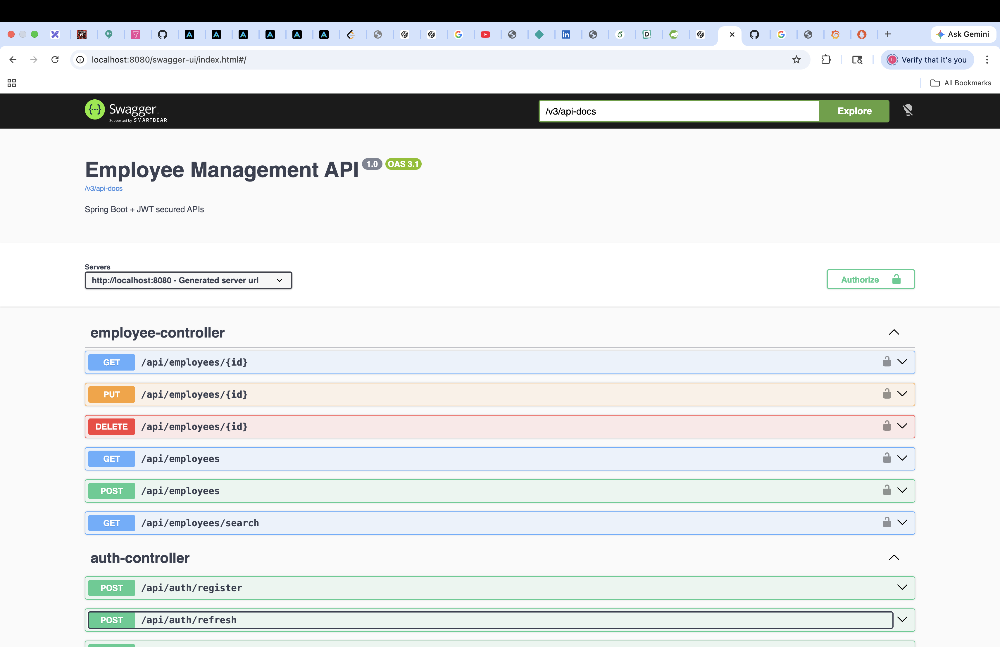
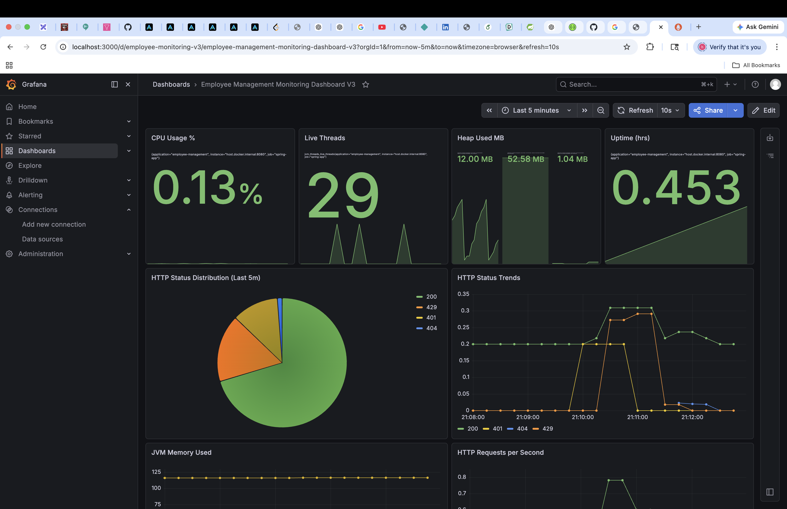

# Employee Management System 🚀

A production-style **Spring Boot backend application** for managing employees with secure authentication, role-based authorization, caching, rate limiting, API documentation, and real-time observability using Prometheus + Grafana.

---

## 📌 Project Highlights

✅ Secure JWT Authentication
✅ Refresh Token Flow
✅ Role-Based Access Control (ADMIN / USER)
✅ CRUD APIs for Employee Management
✅ Search / Filter APIs
✅ Global Exception Handling
✅ Request Validation
✅ Redis Caching
✅ Redis-Based Distributed Rate Limiting (Bucket4j)
✅ PostgreSQL Database
✅ Swagger / OpenAPI Documentation
✅ Spring Boot Actuator Metrics
✅ Prometheus Monitoring
✅ Custom Grafana Dashboard
✅ Docker Compose Infra Setup

---

## 🛠 Tech Stack

| Layer         | Technology                  |
| ------------- | --------------------------- |
| Backend       | Java 21, Spring Boot        |
| Security      | Spring Security, JWT        |
| Database      | PostgreSQL                  |
| ORM           | Spring Data JPA, Hibernate  |
| Cache         | Redis                       |
| Rate Limiting | Bucket4j + Redis            |
| Monitoring    | Spring Actuator, Micrometer |
| Metrics       | Prometheus                  |
| Visualization | Grafana                     |
| API Docs      | Swagger / OpenAPI           |
| Build Tool    | Maven                       |
| Infra         | Docker Compose              |

---

## 📷 Screenshots

### 🔹 API Documentation (Swagger UI)



---

### 🔹 Monitoring Dashboard (Grafana)



---

## 🔐 Authentication & Authorization

### JWT Access Token

Used for securing APIs.

### Refresh Token

Allows generating new access tokens without re-login.

### Roles

#### ADMIN

* Create Employee
* Update Employee
* Delete Employee
* View Employees

#### USER

* View Employees
* Search Employees

---

## 📦 Core APIs

### Auth APIs

```http
POST /api/auth/register
POST /api/auth/login
POST /api/auth/refresh
```

### Employee APIs

```http
GET    /api/employees
GET    /api/employees/{id}
POST   /api/employees
PUT    /api/employees/{id}
DELETE /api/employees/{id}
GET    /api/employees/search
```

---

## ⚡ Advanced Backend Features

### ✅ Redis Caching

Frequently accessed employee data is cached for faster reads.

### ✅ Distributed Rate Limiting

Protected APIs using Bucket4j + Redis.

Examples:

* Login APIs limited by IP
* Employee APIs limited by username/token

### ✅ Validation

Examples:

* Name required
* Valid email required
* Salary constraints

### ✅ Global Exception Handling

Standard JSON error responses:

```json
{
  "timestamp": "...",
  "status": 400,
  "error": "Bad Request",
  "message": "Validation failed"
}
```

---

## 📈 Monitoring & Observability

Integrated production-grade monitoring stack.

### Metrics Collected

* CPU Usage
* JVM Heap Memory
* Live Threads
* Uptime
* HTTP Requests/sec
* HTTP Status Code Trends
* Slow APIs
* DB Connections
* Redis Usage
* Disk Free Space

### Tools Used

* Spring Boot Actuator
* Micrometer
* Prometheus
* Grafana

---

## 🐳 Local Development Infra

Managed using Docker Compose:

* PostgreSQL
* Redis
* Prometheus
* Grafana

Run:

```bash
docker compose up -d
```

---

## 🚀 Run Project Locally

### 1. Clone Repo

```bash
git clone https://github.com/hiteshk1911/employee-management.git
cd employee-management
```

### 2. Start Infra

```bash
docker compose up -d
```

### 3. Run Spring Boot App

```bash
mvn spring-boot:run
```

---

## 🌐 Access URLs

### Swagger

[http://localhost:8080/swagger-ui/index.html](http://localhost:8080/swagger-ui/index.html)

### Prometheus

[http://localhost:9090](http://localhost:9090)

### Grafana

[http://localhost:3000](http://localhost:3000)

---

## 🧠 Key Learnings Demonstrated

* Designing secure REST APIs
* Stateless authentication using JWT
* Role-based authorization
* Distributed caching strategies
* Rate limiting design patterns
* Spring Boot production practices
* Monitoring & observability
* Dockerized local environments

---

## 📌 Future Improvements

* CI/CD with GitHub Actions
* Unit & Integration Testing
* Email Notifications
* Audit Logging
* Kubernetes Deployment
* Alerting via Slack / Email

---

## 👨‍💻 Author

**Hitesh Kumar**

GitHub: [https://github.com/hiteshk1911](https://github.com/hiteshk1911)
LinkedIn: [https://linkedin.com/in/hitesh-kumar-2757b7161/](https://linkedin.com/in/hitesh-kumar-2757b7161/)

---

## ⭐ If you found this project useful, consider starring the repo.
